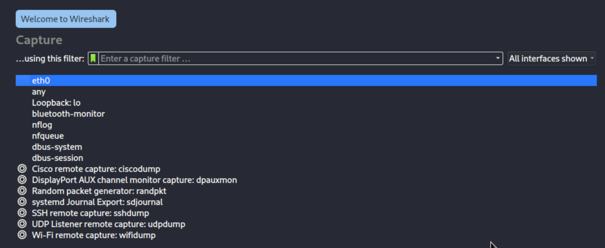
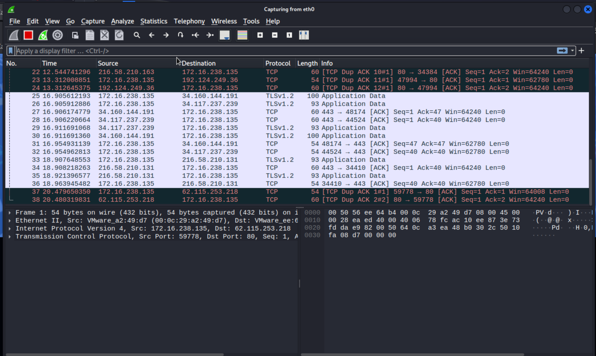
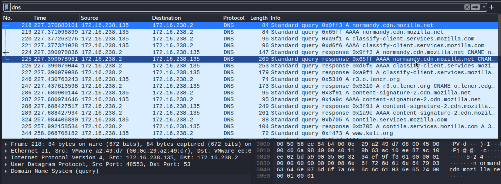

# Sieppaa ja monitoroi verkkoliikennettä.
Käytin Debianiin perustuvaa Kali Linux käyttöjärjestelmää, koska se sisältää tehtävään vaaditut työkalut valmiiksi asennettuina.

Valitsin työkaluksi tehtävään ohjelman nimeltä Wireshark, joka käynnistää ohjelman NetworkAnalyzer syöttämällä komentotulkkiin komennon:
```bash
wireshark
```

Aloin monitoroimaan ethernet 0 liitäntää (eli ensimmäistä ethernet liitäntää) tuplaklikkaamalla kohtaa eth0 interface.



Wireshark on työkalu, joka tarjoaa runsaasti tietoja verkkoliikenteestä, kuten IP-osoitteista ja porttinumeroista, jotka ovat mukana tietoliikenteessä.



Esimerkiksi, kun avasin Google.com -sivun, Wireshark tallensi verkkoliikenteestä kaiken tärkeän tiedon. Wiresharkia voi siis käyttää liikenteen tarkastelemiseen ja suodattamiseen. Tämä tapahtuu kirjoittamalla "Apply a display filter" -kenttään haluttu suodatin. Esimerkiksi, DNS-suodattimella pystyin tarkastelemaan vain DNS-liikennettä ja selvittämään palvelimen osoitteen nimen.



On tärkeää muistaa, että tiedon tarkastelu Wiresharkilla on laillista vain, jos sinulla on asianmukaiset valtuutukset ja luvat, ja käytät työkalua vain laillisiin tarkoituksiin.
